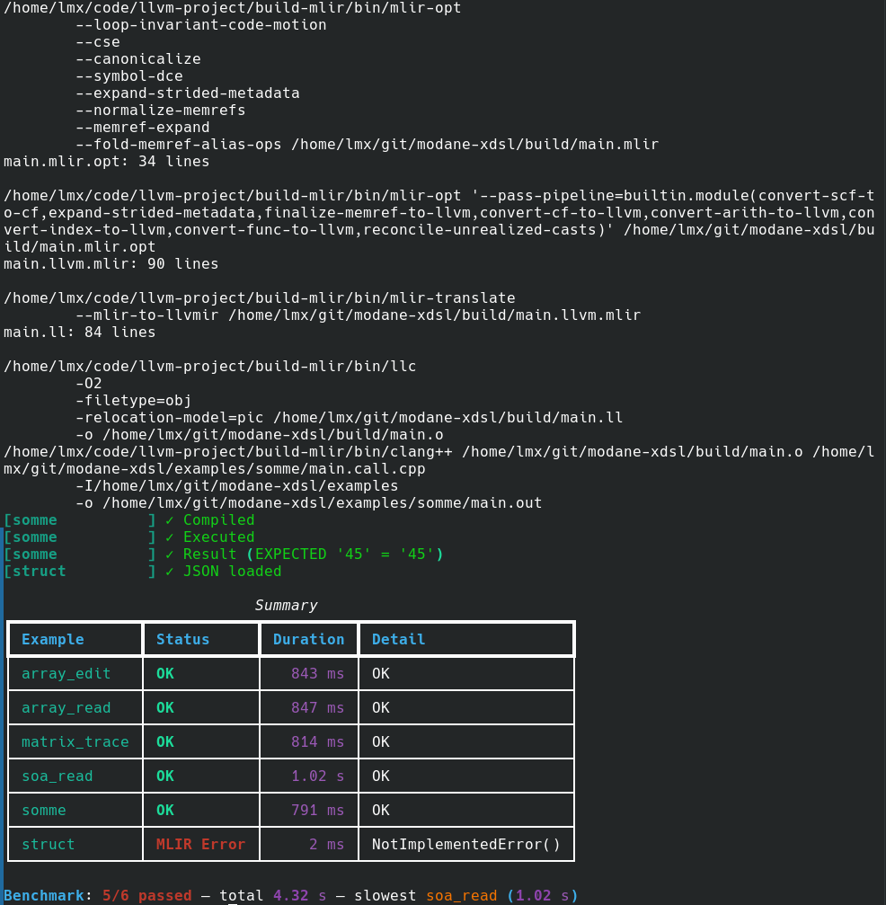

# xdsl-json

This project lets you generate specialized shared libraries using MLIR, based on JSON function descriptions.
The generated libraries can then be called from your codebase without having to write a complex front-end for your solution.

Unlike working directly with MLIR, the JSON description provides an extra level of abstraction.
This solution is designed to be generic, modular, and accessible — make sure you have a good understanding of each operation before using it.

Additionally, the [xDSL](https://xdsl.dev/) Python library lets you easily define your own dialects and passes.
Feel free to check out their interactive tutorials!


## Usage

Currently, this solution takes a JSON file as input, generates a library containing the functions described in that file, and then compiles a `main.call.cpp` file that calls this library.

```bash
git clone git@github.com:LouisMaxHa/xdsl-json.git
cd xdsl-json
git submodule update --init --recursive
make install

# Run example
uv run python src/xdsljson/pipeline/cli.py examples/soa_read/main.json  

# Run tests
uv run python tests/run_tests.py 
```

## Options
- `--tree`, `-T`        : Print the Python AST as a **T**ree
- `--xdsl`, `-x`        : Print the generated **x**DSL code
- `--xdsl_passes`, `-p` : Print the generated xDSL code after each xDSL **p**ass
- `--xdsl_opti`, `-X`   : Print the generated xDSL code after all xDSL passes
- `--mlir`, `-m`        : Print the generated **M**LIR code
- `--mlir_opti`, `-M`   : Print the generated MLIR code after MLIR passes
- `--mlir_llvm`, `-l`   : Print the MLIR code using the LLVM MLIR dialect
- `--llvm`, `-L`        : Print the generated **L**LVM code
- `--cmd`, `-C`         : Print the **c**ommands used during code generation

- `--mlir-bin-dir` : Directory containing the `mlir-opt` executable
- `--project-root` : Change the current directory (used for `./build`)

## Execution trace example




## Project structure

```text
.
├── docs/             # Documentation
│   ├── diapo/             # Presentation slides
│   ├── cpp_examples/      # C++ code example that calls an MLIR function with an array parameter
│   └── rapport/           # Work in progress
|
├── examples/         # Files to compile
│   ├── memref_bridge.h    # Converts an array to a MemRef-compatible structure
│   └── array-read/        # An example
│       ├── main.json      # MLIR function to generate
│       └── main.call.cpp  # C++ function calling the generated function
│
├── src/xdsljson/     # Project source code
│   ├── operations/        # Operation definitions
│   ├── pipeline/          # Compilation pipeline management
│   ├── utils/             # Utilities
│   └── variables/
│       ├── ty/            # Type definitions
│       ├── val/           # Instance definitions (= types + memory address)
│       ├── factory.py     # Create instances from a type
│       ├── memory.py      # Register and access instances
│       └── var.py         # Association between variable name <-> instance
│
└── tests/
    └── run_tests.py       # Run tests
```

## Trace example

We want to generate a function that look like this:
```python
def xdsl_main(max: int) -> int:
    toto = 0
    i = 0
    while i < max:
        toto = toto + i
        i = i + 1
    return toto
```

We start by writting by hand the Json version (this step can be automated for your custom language).

```json
{ "op": "module",
  "body": [
    { "op": "function",
      "name": "xdsl_main",
      "args": [["max", "i64"]],
      "body": [
        { "op": "set",
          "var": { "op": "var", "name": "toto", "type": "i64" },
          "val": { "op": "const", "val": 0 }
        },
        { "op": "set",
          "var": { "op": "var", "name": "i", "type": "i64" },
          "val": { "op": "const", "val": 0 }
        },
        { "op": "while",
          "cond": { "op": "binary",
            "ope": "<",
            "lhs": { "op": "var", "name": "i" },
            "rhs": { "op": "var", "name": "max" }
          },
          "thenBlock": [
            { "op": "set",
              "var": { "op": "var", "name": "toto" },
              "val": { "op": "binary",
                "ope": "+",
                "lhs": { "op": "var", "name": "toto" },
                "rhs": { "op": "var", "name": "i" }
              }
            },
            { "op": "set",
              "var": { "op": "var", "name": "i" },
              "val": { "op": "binary",
                "ope": "+",
                "lhs": { "op": "var", "name": "i" },
                "rhs": { "op": "const", "val": 1 }
              }
            }
          ]
        },
        { "op": "var", "name": "toto" }
      ]
    }
  ]
}
```

We can then call our compiler tool :
```bash
uv run python src/xdsljson/pipeline/cli.py examples/somme/main.json  -TxmML
# Equivalent to
We start by 
```

```
────── Python AST
ModuleJsonOp  ← []
└── FunctionOp('xdsl_main')  ← []
    ├── Init args
    │   └── Factory.from_val  ← ValScalar(addr, Scalar(i64))
    │       └── ValScalar.init_from  ← ValScalar(addr, Scalar(i64))
    │           │       - type = Scalar(i64)
    │           │       - source = ValSSA()
    │           │       - builder = <Builder ... >
    │           └── ValScalar._store([], ValSSA())  ← None
    └── CodegenBlock  ← (<Block ... >, [ValSSA()])
        │       - content = [SetOp, SetOp, WhileOp, VarOp]
        │       - block = <Block ... >
        ├── SetOp('toto')  ← []
        │   ├── ConstOp(0, <Scalar.i64: 'i64'>)  ← [ValSSA()]
        │   └── Factory.from_val  ← ValScalar(addr, Scalar(i64))
        │       └── ValScalar.init_from  ← ValScalar(addr, Scalar(i64))
        │           │       - type = Scalar(i64)
        │           │       - source = ValSSA()
        │           │       - builder = <Builder ... >
        │           └── ValScalar._store([], ValSSA())  ← None
        ├── SetOp('i')  ← []
        │   ├── ConstOp(0, <Scalar.i64: 'i64'>)  ← [ValSSA()]
        │   └── Factory.from_val  ← ValScalar(addr, Scalar(i64))
        │       └── ValScalar.init_from  ← ValScalar(addr, Scalar(i64))
        │           │       - type = Scalar(i64)
        │           │       - source = ValSSA()
        │           │       - builder = <Builder ... >
        │           └── ValScalar._store([], ValSSA())  ← None
        ├── WhileOp  ← []
        │   ├── BinaryOp('<')  ← [ValSSA()]
        │   │   ├── VarOp('i', [])  ← [ValSSA()]
        │   │   │   └── ValScalar._load([])  ← ValSSA()
        │   │   └── VarOp('max', [])  ← [ValSSA()]
        │   │       └── ValScalar._load([])  ← ValSSA()
        │   └── CodegenBlock  ← (<Block ... >, [])
        │       │       - content = [SetOp, SetOp]
        │       │       - block = <Block ... >
        │       ├── SetOp('toto')  ← []
        │       │   ├── BinaryOp('+')  ← [ValSSA()]
        │       │   │   ├── VarOp('toto', [])  ← [ValSSA()]
        │       │   │   │   └── ValScalar._load([])  ← ValSSA()
        │       │   │   └── VarOp('i', [])  ← [ValSSA()]
        │       │   │       └── ValScalar._load([])  ← ValSSA()
        │       │   └── ValScalar._store([], ValSSA())  ← None
        │       └── SetOp('i')  ← []
        │           ├── BinaryOp('+')  ← [ValSSA()]
        │           │   ├── VarOp('i', [])  ← [ValSSA()]
        │           │   │   └── ValScalar._load([])  ← ValSSA()
        │           │   └── ConstOp(1, <Scalar.i64: 'i64'>)  ← [ValSSA()]
        │           └── ValScalar._store([], ValSSA())  ← None
        └── VarOp('toto', [])  ← [ValSSA()]
            └── ValScalar._load([])  ← ValSSA()

────── xDSL
builtin.module {
  func.func @xdsl_main(%maxArg: i64) -> i64 attributes {llvm.emit_c_interface} {
    %const0.i64 = arith.constant 0 : i64
    %0 = memref.alloca() : memref<i64>
    memref.store %maxArg, %0[] : memref<i64>
    %1 = memref.alloca() : memref<i64>
    memref.store %const0.i64, %1[] : memref<i64>
    %2 = memref.alloca() : memref<i64>
    memref.store %const0.i64, %2[] : memref<i64>
    scf.while () : () -> () {
      %3 = memref.load %2[] : memref<i64>
      %4 = memref.load %0[] : memref<i64>
      %5 = arith.cmpi slt, %3, %4 : i64
      scf.condition(%5)
    } do {
      %const1.i64 = arith.constant 1 : i64
      %6 = memref.load %1[] : memref<i64>
      %7 = memref.load %2[] : memref<i64>
      %8 = arith.addi %6, %7 : i64
      memref.store %8, %1[] : memref<i64>
      %9 = memref.load %2[] : memref<i64>
      %10 = arith.addi %9, %const1.i64 : i64
      memref.store %10, %2[] : memref<i64>
      scf.yield
    }
    %11 = memref.load %1[] : memref<i64>
    func.return %11 : i64
  }
}


────── MLIR
builtin.module {
  func.func @xdsl_main(%maxArg: i64) -> i64 attributes {llvm.emit_c_interface} {
    %const0.i64 = arith.constant 0 : i64
    %0 = memref.alloca() : memref<i64>
    memref.store %maxArg, %0[] : memref<i64>
    %1 = memref.alloca() : memref<i64>
    memref.store %const0.i64, %1[] : memref<i64>
    %2 = memref.alloca() : memref<i64>
    memref.store %const0.i64, %2[] : memref<i64>
    scf.while () : () -> () {
      %3 = memref.load %2[] : memref<i64>
      %4 = memref.load %0[] : memref<i64>
      %5 = arith.cmpi slt, %3, %4 : i64
      scf.condition(%5)
    } do {
      %const1.i64 = arith.constant 1 : i64
      %6 = memref.load %1[] : memref<i64>
      %7 = memref.load %2[] : memref<i64>
      %8 = arith.addi %6, %7 : i64
      memref.store %8, %1[] : memref<i64>
      %9 = memref.load %2[] : memref<i64>
      %10 = arith.addi %9, %const1.i64 : i64
      memref.store %10, %2[] : memref<i64>
      scf.yield
    }
    %11 = memref.load %1[] : memref<i64>
    func.return %11 : i64
  }
}


────── Optimized MLIR
module {
  func.func @xdsl_main(%arg0: i64) -> i64 attributes {llvm.emit_c_interface} {
    %c1_i64 = arith.constant 1 : i64
    %c0_i64 = arith.constant 0 : i64
    %alloca = memref.alloca() : memref<i64>
    memref.store %arg0, %alloca[] : memref<i64>
    %alloca_0 = memref.alloca() : memref<i64>
    memref.store %c0_i64, %alloca_0[] : memref<i64>
    %alloca_1 = memref.alloca() : memref<i64>
    memref.store %c0_i64, %alloca_1[] : memref<i64>
    scf.while : () -> () {
      %1 = memref.load %alloca_1[] : memref<i64>
      %2 = memref.load %alloca[] : memref<i64>
      %3 = arith.cmpi slt, %1, %2 : i64
      scf.condition(%3)
    } do {
      %1 = memref.load %alloca_0[] : memref<i64>
      %2 = memref.load %alloca_1[] : memref<i64>
      %3 = arith.addi %1, %2 : i64
      memref.store %3, %alloca_0[] : memref<i64>
      %4 = memref.load %alloca_1[] : memref<i64>
      %5 = arith.addi %4, %c1_i64 : i64
      memref.store %5, %alloca_1[] : memref<i64>
      scf.yield
    }
    %0 = memref.load %alloca_0[] : memref<i64>
    return %0 : i64
  }
}


────── LLVM
; ModuleID = 'LLVMDialectModule'
source_filename = "LLVMDialectModule"

define i64 @xdsl_main(i64 %0) {
  %2 = alloca i64, i64 1, align 8
  %3 = insertvalue { ptr, ptr, i64 } poison, ptr %2, 0
  %4 = insertvalue { ptr, ptr, i64 } %3, ptr %2, 1
  %5 = insertvalue { ptr, ptr, i64 } %4, i64 0, 2
  %6 = extractvalue { ptr, ptr, i64 } %5, 1
  store i64 %0, ptr %6, align 4
  %7 = alloca i64, i64 1, align 8
  %8 = insertvalue { ptr, ptr, i64 } poison, ptr %7, 0
  %9 = insertvalue { ptr, ptr, i64 } %8, ptr %7, 1
  %10 = insertvalue { ptr, ptr, i64 } %9, i64 0, 2
  %11 = extractvalue { ptr, ptr, i64 } %10, 1
  store i64 0, ptr %11, align 4
  %12 = alloca i64, i64 1, align 8
  %13 = insertvalue { ptr, ptr, i64 } poison, ptr %12, 0
  %14 = insertvalue { ptr, ptr, i64 } %13, ptr %12, 1
  %15 = insertvalue { ptr, ptr, i64 } %14, i64 0, 2
  %16 = extractvalue { ptr, ptr, i64 } %15, 1
  store i64 0, ptr %16, align 4
  br label %17

17:                                               ; preds = %23, %1
  %18 = extractvalue { ptr, ptr, i64 } %15, 1
  %19 = load i64, ptr %18, align 4
  %20 = extractvalue { ptr, ptr, i64 } %5, 1
  %21 = load i64, ptr %20, align 4
  %22 = icmp slt i64 %19, %21
  br i1 %22, label %23, label %34

23:                                               ; preds = %17
  %24 = extractvalue { ptr, ptr, i64 } %10, 1
  %25 = load i64, ptr %24, align 4
  %26 = extractvalue { ptr, ptr, i64 } %15, 1
  %27 = load i64, ptr %26, align 4
  %28 = add i64 %25, %27
  %29 = extractvalue { ptr, ptr, i64 } %10, 1
  store i64 %28, ptr %29, align 4
  %30 = extractvalue { ptr, ptr, i64 } %15, 1
  %31 = load i64, ptr %30, align 4
  %32 = add i64 %31, 1
  %33 = extractvalue { ptr, ptr, i64 } %15, 1
  store i64 %32, ptr %33, align 4
  br label %17

34:                                               ; preds = %17
  %35 = extractvalue { ptr, ptr, i64 } %10, 1
  %36 = load i64, ptr %35, align 4
  ret i64 %36
}

define i64 @_mlir_ciface_xdsl_main(i64 %0) {
  %2 = call i64 @xdsl_main(i64 %0)
  ret i64 %2
}

!llvm.module.flags = !{!0}

!0 = !{i32 2, !"Debug Info Version", i32 3}
```